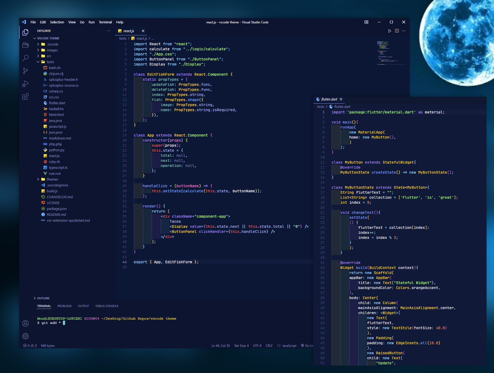

# Kawi Theme

> Kawi Dark theme for VS Code.

# Installation

1.  Install [Visual Studio Code](https://code.visualstudio.com/)
2.  Launch Visual Studio Code
3.  Choose **Extensions** from menu
4.  Search for `kawi`
5.  Click **Install** to install it
6.  Click **Reload** to reload the Code
7.  From the menu bar click: Code > Preferences > Color Theme > Pick your Kawi theme variant

-[ ] check check 12 12 -[ ] check check 12 12

# Heading 1

## Heading 2

### Heading 3
